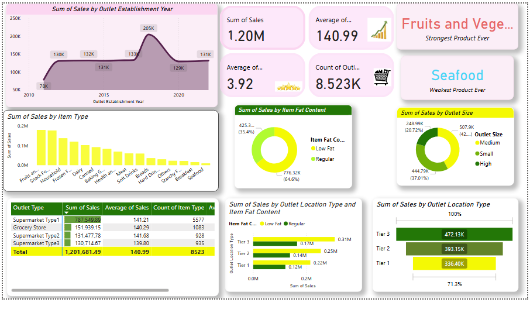

# 🛒 Blinkit Sales Analytics — Power BI Dashboard
### Data Analyst Project | Power BI | By Animesh Ruhela

---

## 📌 Project Overview

An interactive **Power BI Dashboard** built on Blinkit's grocery sales data to analyze sales performance, outlet efficiency, product trends, and customer preferences across multiple store types and locations.

> 💡 **Blinkit** (formerly Grofers) is India's leading instant grocery delivery platform.

---

## 🖼️ Dashboard Preview



---

## 🎯 Objectives

- Track overall **KPIs** — Total Sales, Average Sales, Average Rating, Outlet Count
- Analyze **sales trends** by outlet establishment year (2010–2022)
- Compare performance across **outlet types, sizes, and locations**
- Identify **top and bottom performing product categories**
- Understand **fat content** distribution impact on sales

---

## 📊 Key KPIs & Insights

| Metric | Value |
|--------|-------|
| 💰 Total Sales | ₹1.20 Million |
| 📦 Average Sales per Item | ₹140.99 |
| ⭐ Average Customer Rating | 3.92 / 5 |
| 🏪 Total Outlets | 8,523 |
| 🥦 Strongest Product | Fruits & Vegetables |
| 🐟 Weakest Product | Seafood |

---

## 📈 Dashboard Visualizations

| Visual | Description |
|--------|-------------|
| 📉 Line Chart | Sales trend by Outlet Establishment Year (2010–2022) |
| 📊 Bar Chart | Sales by Item Type (16 categories) |
| 🍩 Donut Chart | Sales by Item Fat Content (Low Fat vs Regular) |
| 🍩 Donut Chart | Sales by Outlet Size (Small / Medium / High) |
| 📊 Stacked Bar | Sales by Outlet Location Type & Fat Content |
| 📊 Bar Chart | Sales by Outlet Location Tier (Tier 1/2/3) |
| 📋 Table | Outlet Type wise — Sales, Avg Sales, Item Count |

---

## 🗃️ Dataset Details

**File:** `BlinkIT_Grocery_Data_Excel.xlsx`
**Records:** 8,523 rows | 12 columns

| Column | Description |
|--------|-------------|
| Item Fat Content | Low Fat / Regular |
| Item Identifier | Unique product ID |
| Item Type | Product category (16 types) |
| Outlet Establishment Year | Year outlet was established |
| Outlet Identifier | Unique outlet ID |
| Outlet Location Type | Tier 1 / Tier 2 / Tier 3 |
| Outlet Size | Small / Medium / High |
| Outlet Type | Supermarket Type 1/2/3, Grocery Store |
| Item Visibility | Product visibility score |
| Item Weight | Weight of the item |
| Sales | Item sales value |
| Rating | Customer rating (1–5) |

---

## 🔍 Key Business Insights

**1. 📍 Outlet Performance:**
- Supermarket Type1 dominates with **₹787K in sales** (65% of total)
- Grocery Stores contribute ₹151K despite high outlet count

**2. 📅 Sales Trend:**
- Peak sales recorded in **2022 at ₹205K**
- Significant dip between 2011–2014 before recovery

**3. 🏙️ Location Analysis:**
- **Tier 3** cities generate highest sales — ₹472K (39.3%)
- Tier 2 follows with ₹393K, Tier 1 with ₹336K

**4. 🥗 Fat Content:**
- **Regular items** (64.6%) outsell Low Fat (35.4%) significantly

**5. 🏪 Outlet Size:**
- **Medium outlets** lead with ₹507.9K (42.3% of total)

---

## 🛠️ Tools Used

- **Power BI Desktop** — Dashboard creation
- **Microsoft Excel** — Data source
- **DAX** — Calculated measures & KPIs
- **Power Query** — Data transformation & cleaning

---

## 📁 Project Structure

```
blinkit_dashboard_project/
│
├── 📊 Blinkit_Dashboard.pbix          # Power BI file
├── 📄 BlinkIT_Grocery_Data_Excel.xlsx # Dataset
├── 🖼️ dashboard_screenshot.png        # Dashboard preview
└── 📝 README.md                       # Project documentation
```

---

## ▶️ How to Use

1. Clone this repository:
```bash
git clone https://github.com/animehruhela/blinkit-dashboard
```

2. Open **Power BI Desktop** (free download from Microsoft)

3. Open `Blinkit_Dashboard.pbix` file

4. Refresh data source if needed — point to `BlinkIT_Grocery_Data_Excel.xlsx`

5. Explore the interactive dashboard! ✅

---

## 📧 Contact

**Animesh Ruhela**
📧 animeshruhela@gmail.com
📱 7017835989

---

⭐ If you found this project useful, give it a star on GitHub!
